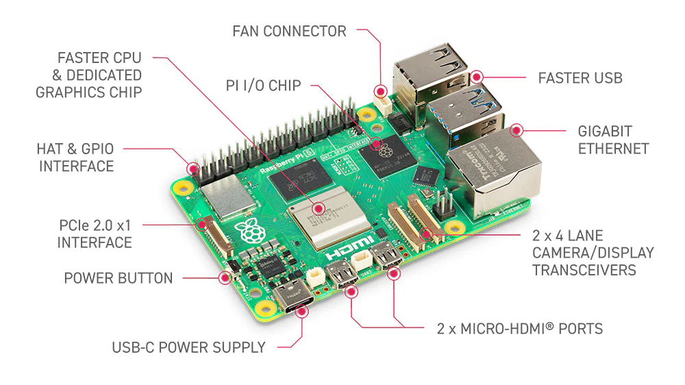

# RPi-5 projects

## [Raspberry Pi 5](https://www.raspberrypi.com/products/raspberry-pi-5/)

---
### Download Raspberry Pi OS (64-bit)
**Method 1.** Download [Raspberry Pi Imager](https://downloads.raspberrypi.org/imager/imager_latest.exe). Then, run the imager; on the operating system dialog, select `Raspberry Pi OS (64-Bit)`. 

**Method 2.** Download [Raspberry Pi OS (64-bit)](https://www.raspberrypi.com/software/operating-systems/#raspberry-pi-os-64-bit) and use [BalenaEtcher](https://etcher.balena.io/) to write into a 32/64GB SDCard 
select [Raspberry Pi OS with desktop](https://downloads.raspberrypi.com/raspios_arm64/images/raspios_arm64-2024-07-04/2024-07-04-raspios-bookworm-arm64.img.xz) to download. 

---
### Copyright

Copyright (C) 2024 rkuo2000, https://www.facebook.com/richard.kuo.168

**Mediumish for Jekyll** is designed and developed by [Sal](https://www.wowthemes.net) and it is *free* under MIT license. 

